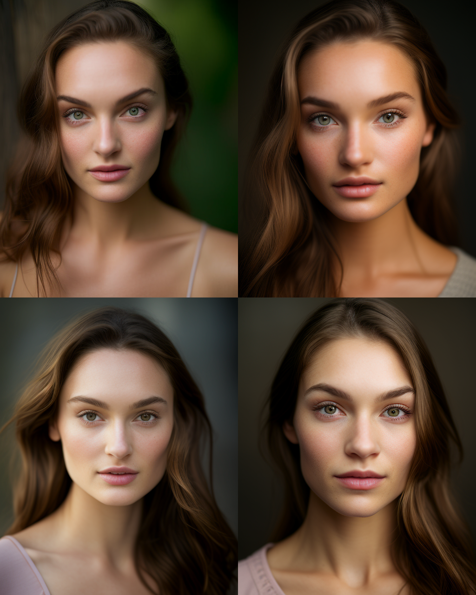
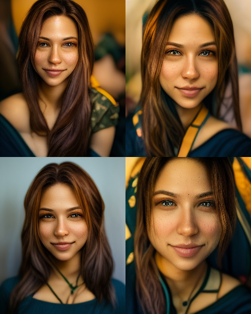
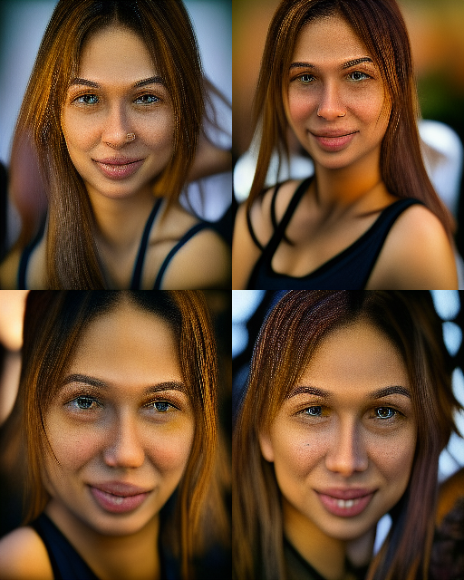
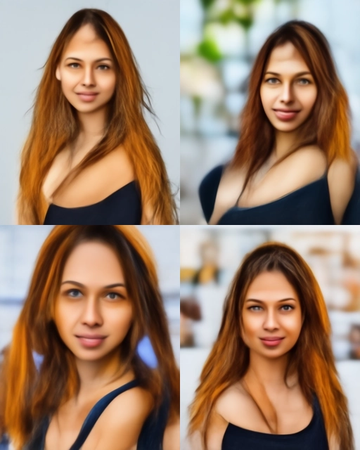

# Midjourney

<table>
<tr>
<th></th>
<th>Version 5</th>
<th>Version 4</th>
<th>Version 3</th>
<th>Version 2</th>
<th>Version 1</th>
</tr>
<tr>
<td>Release</td>
<td>March 2023</td>
<td>November 2022</td>
<td>July 2022</td>
<td>April 2022</td>
<td>March 2022</td>
</tr>
<tr>
<td>Hands</td>
<td>Ok</td>
<td>Bad</td>
<td>Bad</td>
<td>Bad</td>
<td>Bad</td>
</tr>
<tr>
<td>Text</td>
<td>Bad</td>
<td>Bad</td>
<td>Bad</td>
<td>Bad</td>
<td>Bad</td>
</tr>
<tr>

</tr>
</table>

Version comparision with prompt

```
Prompt 1: /imagine
An attractive woman in her 20's, with light skin, natural, no make up, natural inperfections, hazel colored 
eyes, lush light brown hair, the photo should be half-length portrait, shallow depth of field to emphsize the subject, 
taken using a Conon EOS R camera with a 50mm f/1.8 lens, f/2.2 aperture, shutter speech 1/200s, ISO 100 and a lot of 
lighting, Full Body, Hyper Realistic Photography, Cinematic, Cinema, Hyperdetail, Ultrahd,
Color Correction, ultrahd, hdr, color grading, 8k, --ar 4:5 --q 2 --s 750
```

<table>
<th><center>V5</center></th>
<th><center>V4</center></th>
<th><center>V3</center></th>
<th><center>V2</center></th>
<th><center>V1</center></th>
</tr>
<tr>
<td></td>
<td></td>
<td></td>
<td></td>
<td></td>
</tr>
</table>

## References

* [Comparison --v4 and --v5 MidJourney](https://www.youtube.com/watch?v=laZX2JBxSas&ab_channel=ITrepeat)
* [All MIDJOURNEY Comparison --v1 --v2 --v3 --v4 --v5](https://www.youtube.com/watch?v=y_GGw4dglVU&ab_channel=ITrepeat)
